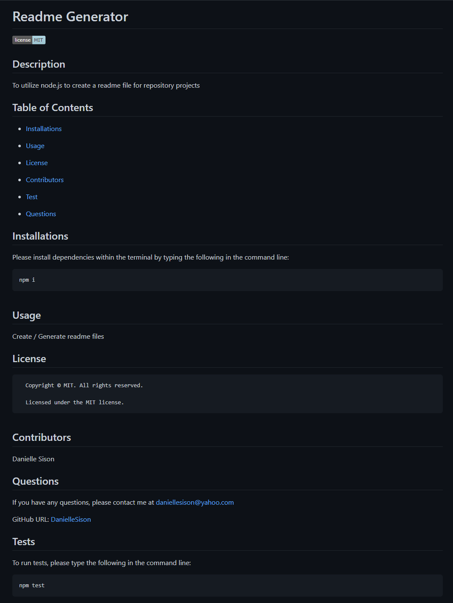

# Nux Legere XIV

## Video Submission Link: https://watch.screencastify.com/v/syA3mmEv3TWHLNUciIYW

## Description

Utilizing node.js to create a readme file for repository projects

## Installations

Please install the following through your terminal:

```
npm i

npm i inquirer@8.2.4
```

## Usage

Please run the following through your terminal: 

```
node index.js
```

The following questions will be asked after running node index.js and the user will be prompted to answer:

<ul>
<li>Provide your project title.</li>
<li>Describe your project.</li>
<li>Which dependencies do you need to install, you may choose the default option on this one (Press Enter).</li>
<li>What is the usage of this repository?</li>
<li>What license are you utilizing? (Choose with the arrow buttons).</li>
<li>List down the contributors in this repository.</li>
<li>What should be written into the terminal / command line to run tests, you may also choose the default option.</li>
<li>Provide your GitHub username.</li>
<li>Provide your e-mail for further questions about the repository.</li>
</ul>


## Screenshot

Below is a screenshot of the sample readme generated, it can also be found under the sample folder in this repository.



## Credits

The following programs / guides were used to create this project:

<ul>
<li>Node.js - https://nodejs.org/en/</li>
<li>Inquirer.js - https://www.npmjs.com/package/inquirer</li>
</ul>

Thank you to the instructors and TA's that helped with this project.

## License

N/A


